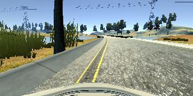
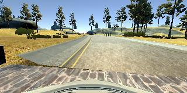
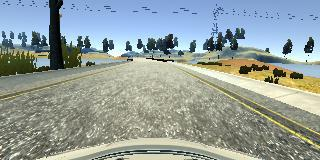
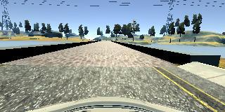

## **Behavioral Cloning Project** 

The goals / steps of this project are the following:

* Use the simulator to collect data of good driving behavior
* Build a convolution neural network in Keras that predicts steering angles from images
* Train and validate the model with a training and validation set
* Test that the model successfully drives around track one without leaving the road
* Summarize the results with a written report

---

## Gathering training data

I gathered training data by driving manually around the track twice, using the mouse, going at full speed, backwards around the first (simple) track once. I also recorded several recovery from either side sequences, so the network knows how to recover from situations where it gets too close to the side of the road.

## Data augmentation
I added in reading of the left offset image and the right offset image from the CSV file, pairing those with steering offset corrections of 0.2 for left and -0.2 for right, as you can see on line 32 of model.py.

I then flip each of the three images (left, center, right) horizontally, pairing them with negated three steering angles. This helps it learn both left and right turns evenly.

## The first model
I started out using an adapted LeNet model, implemented in Keras. With enough training data, this worked well enough to get the car to the bridge, but it quickly drove off the road at around this point.

## The next model
Then I then switched to a model which is based on the [Nvidia end-to-end self driving model](https://devblogs.nvidia.com/parallelforall/deep-learning-self-driving-cars/). This worked much better.

The model consists of a neural network with two data processing layers, five convolutional layers, one flatten layer, and five fully connected layers, implemented via Keras. These can be seen on lines 62, 68, 75, and 78 of model.py.

The first data processing layer is a crop layer, to only show the model the section that is relevant to driving, the road, cutting out the sky and the car hood, on line 62.

The second data processing layer is a normalization layer, implemented by a Keras lambda layer, normalizes the colour channels down from 0-255 to -0.5 to 0.5, centered around 0.

The first three of the five convolutional layers have kernels of 5 by 5 pixels, and the last two have 3 by 3. The output number of layers for these convolutional layers are 24, 36, 48, 64, and 64. They all use ReLU activation to introduce non-linearity into the model.

The fully connected layers all use ReLU with the exception of the last, the output layer, which uses Tanh. They have neural counts of 200, 100, 50, 10, and finally 1.

At first I had the fully connected section start with a 1000 neuron fully connected layer, but this resulted in a 110mb saved weights trained model, which was excessive for github, so I reduced the fully connected first layer down to 200, and performance was not hindered.

## Reducing overfitting
I experimented with adding a dropout layer after the first fully connected layer, with dropout rate 0.5, as well with one after the second fully connected layer. This actually decreased the driving performance, having the car run off the road in both cases. So I removed the dropout layers.

Driving the car around the track backwards and flipping the images seems enough to reduce overfitting to the exact track layout.

## Training

I split the data into a 20% validation set and 80% training set. At first I was training for five epochs, but I found the validation loss was not improving much after the first epoch, so I switched to just training one epoch. The model used an adam optimizer, so the learning rate didn't need to be tuned manually.

## Results

After training the model using the gathered driving data, I ran the model on the track and it drove fully around the track autonomously. But it wasn't the smoothest ride, where the car has a little trouble in certain areas, such as just before the bridge:

And just after the bridge:

Both times veering to the left.

I collected some more data around those areas, driving straight in the middle of the road past those areas, and retrained.

The results were better. Now the car stayed close to the center of the road in these areas.

And the bridge entry.

